Chapter 2: Statistical Learning
================
Sebastian Quirarte
2026-04-08

- [Lab: Introduction to R](#lab-introduction-to-r)
  - [Basic commands](#basic-commands)
  - [Graphics](#graphics)
  - [Indexing Data](#indexing-data)
  - [Loading Data](#loading-data)
  - [Additional Graphical and Numerical
    Summaries](#additional-graphical-and-numerical-summaries)
- [Exercises](#exercises)
  - [Conceptual](#conceptual)

Labs and exercises for the book ‘An Introduction to Statistical
Learning’ by Gareth James, Daniela Witten, Trevor Hastie, and Rob
Tibshirani. Full book is available
[here](https://www.statlearning.com/).

## Lab: Introduction to R

### Basic commands

``` r
# Create a vector of numbers 
x <- c(1, 3, 2, 5)
x
```

    ## [1] 1 3 2 5

``` r
# Sum two vectors of the same length 
x <- c(1, 6, 2)
y <- c(1, 4, 3) 
x + y
```

    ## [1]  2 10  5

``` r
# View variables
ls()
```

    ## [1] "x" "y"

``` r
# Delete variables 
rm(x, y)
ls()
```

    ## character(0)

``` r
# Delete all variables at once
rm(list = ls())
```

``` r
# Create a matrix
x <- matrix(data = c(1, 2, 3, 4), nrow = 2, ncol = 2) # by column (default)
x
```

    ##      [,1] [,2]
    ## [1,]    1    3
    ## [2,]    2    4

``` r
x <- matrix(data = c(1, 2, 3, 4), nrow = 2, ncol = 2, byrow = TRUE) # by row
x
```

    ##      [,1] [,2]
    ## [1,]    1    2
    ## [2,]    3    4

``` r
# sqrt and power can be applied to vectors and matrices
sqrt(x)
```

    ##          [,1]     [,2]
    ## [1,] 1.000000 1.414214
    ## [2,] 1.732051 2.000000

``` r
x^2
```

    ##      [,1] [,2]
    ## [1,]    1    4
    ## [2,]    9   16

``` r
# Random normal variables
x <- rnorm(50)
y <- x + rnorm(50, mean = 50, sd = 0.1)
# Correlation between variables
cor(x, y)
```

    ## [1] 0.9938949

``` r
# We can replicate results by setting a seed value
set.seed(1303)
rnorm(50)
```

    ##  [1] -1.1439763145  1.3421293656  2.1853904757  0.5363925179  0.0631929665
    ##  [6]  0.5022344825 -0.0004167247  0.5658198405 -0.5725226890 -1.1102250073
    ## [11] -0.0486871234 -0.6956562176  0.8289174803  0.2066528551 -0.2356745091
    ## [16] -0.5563104914 -0.3647543571  0.8623550343 -0.6307715354  0.3136021252
    ## [21] -0.9314953177  0.8238676185  0.5233707021  0.7069214120  0.4202043256
    ## [26] -0.2690521547 -1.5103172999 -0.6902124766 -0.1434719524 -1.0135274099
    ## [31]  1.5732737361  0.0127465055  0.8726470499  0.4220661905 -0.0188157917
    ## [36]  2.6157489689 -0.6931401748 -0.2663217810 -0.7206364412  1.3677342065
    ## [41]  0.2640073322  0.6321868074 -1.3306509858  0.0268888182  1.0406363208
    ## [46]  1.3120237985 -0.0300020767 -0.2500257125  0.0234144857  1.6598706557

``` r
set.seed(3)
y <- rnorm(100)

mean(y) # mean 
```

    ## [1] 0.01103557

``` r
var(y) # variance
```

    ## [1] 0.7328675

``` r
sqrt(var(y)) # SD
```

    ## [1] 0.8560768

``` r
sd(y) # SD
```

    ## [1] 0.8560768

### Graphics

``` r
x <- rnorm(100)
y <- rnorm(100)
plot(x, y)
```

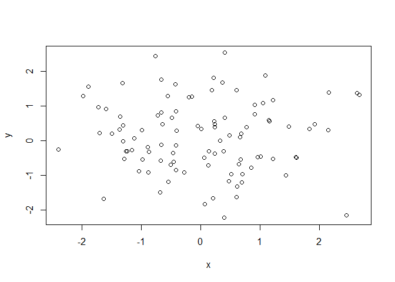<!-- -->

``` r
plot(x, y, xlab = "This is the x-axis",
           ylab = "This is the y-axis",
           main = "Plot of X vs Y")
```

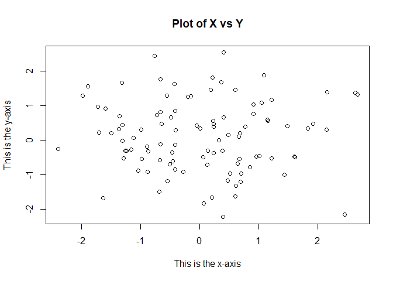<!-- -->

``` r
# Sequence of numbers between a and b
x <- seq(1, 10)
x
```

    ##  [1]  1  2  3  4  5  6  7  8  9 10

``` r
x <- 1:10 # same as seq(1, 10)
x
```

    ##  [1]  1  2  3  4  5  6  7  8  9 10

``` r
# Contour plot to present 3D data
y <- x
f <- outer(x, y, function(x, y) cos(y) / (1 + x^2))
contour(x, y, f)
contour(x, y, f, nlevels = 45, add = T)
```

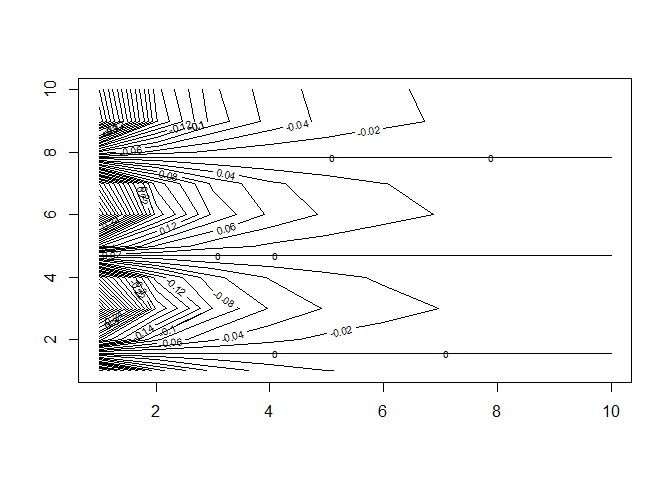<!-- -->

``` r
fa <- (f - t(f)) / 2
contour(x, y, fa, nlevels = 15)
```

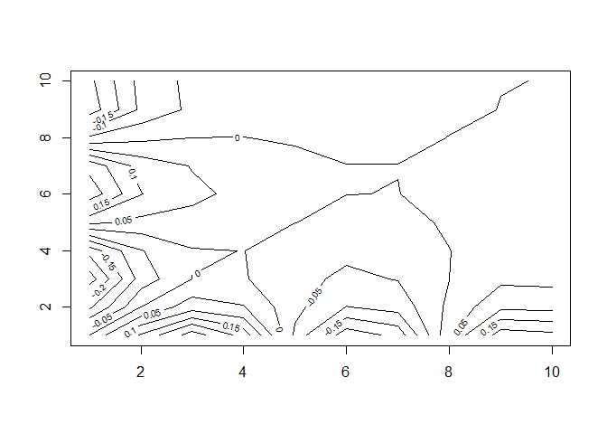<!-- -->

``` r
# image and persp can be used to view 3d plots
image(x, y, fa)
```

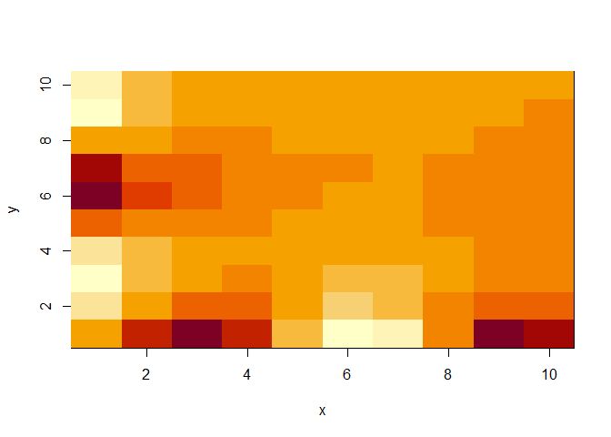<!-- -->

``` r
persp(x, y, fa)
```

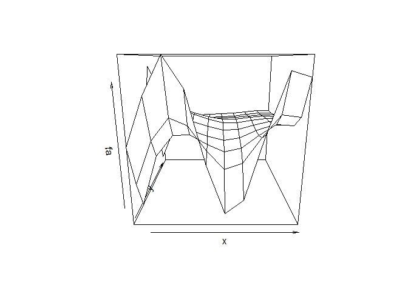<!-- -->

``` r
# Theta and phi adjust the camara angle
persp(x, y, fa, theta = 30)
```

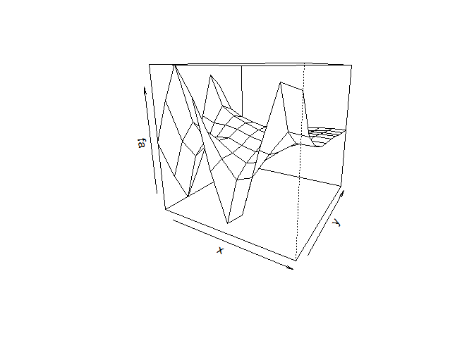<!-- -->

``` r
persp(x, y, fa, theta = 30, phi = 40)
```

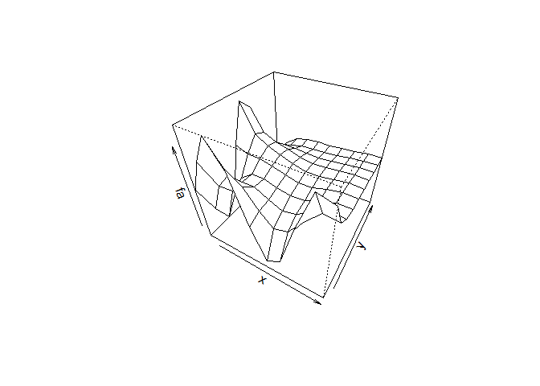<!-- -->

### Indexing Data

``` r
# Data stored in matrix
A <- matrix(1:16, 4, 4)
A
```

    ##      [,1] [,2] [,3] [,4]
    ## [1,]    1    5    9   13
    ## [2,]    2    6   10   14
    ## [3,]    3    7   11   15
    ## [4,]    4    8   12   16

``` r
# Value at row 2, column 3
A[2, 3]
```

    ## [1] 10

``` r
# Subsets of multiple rows and columns
A[c(1, 3), c(2, 4)]
```

    ##      [,1] [,2]
    ## [1,]    5   13
    ## [2,]    7   15

``` r
A[1:3, 2:4]
```

    ##      [,1] [,2] [,3]
    ## [1,]    5    9   13
    ## [2,]    6   10   14
    ## [3,]    7   11   15

``` r
A[1:2, ]
```

    ##      [,1] [,2] [,3] [,4]
    ## [1,]    1    5    9   13
    ## [2,]    2    6   10   14

``` r
A[, 1:2]
```

    ##      [,1] [,2]
    ## [1,]    1    5
    ## [2,]    2    6
    ## [3,]    3    7
    ## [4,]    4    8

``` r
A[1, ] # R treats a single row or column as a vector
```

    ## [1]  1  5  9 13

``` r
A[-c(1,3), -c(1, 3, 4)] # Using a negative index indicates all except
```

    ## [1] 6 8

``` r
dim(A) # dimensions of matrix (row, col)
```

    ## [1] 4 4

### Loading Data

``` r
# The Auto dataset is loaded from the ISLR2 package
library(ISLR2)
```

    ## Warning: package 'ISLR2' was built under R version 4.4.3

``` r
Auto <- Auto
head(Auto, header = T, na.string = '?')
```

    ##   mpg cylinders displacement horsepower weight acceleration year origin
    ## 1  18         8          307        130   3504         12.0   70      1
    ## 2  15         8          350        165   3693         11.5   70      1
    ## 3  18         8          318        150   3436         11.0   70      1
    ## 4  16         8          304        150   3433         12.0   70      1
    ## 5  17         8          302        140   3449         10.5   70      1
    ## 6  15         8          429        198   4341         10.0   70      1
    ##                        name
    ## 1 chevrolet chevelle malibu
    ## 2         buick skylark 320
    ## 3        plymouth satellite
    ## 4             amc rebel sst
    ## 5               ford torino
    ## 6          ford galaxie 500

``` r
dim(Auto) # rows x columns
```

    ## [1] 392   9

``` r
names(Auto) # varible names
```

    ## [1] "mpg"          "cylinders"    "displacement" "horsepower"   "weight"      
    ## [6] "acceleration" "year"         "origin"       "name"

### Additional Graphical and Numerical Summaries

``` r
plot(Auto$cylinders, Auto$mpg)
```

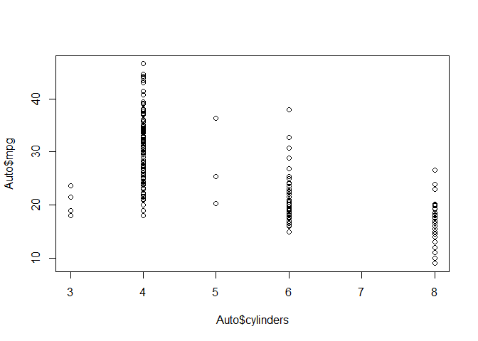<!-- -->

``` r
attach(Auto) # load variables locally so they can be called directly by name
plot(cylinders, mpg)
```

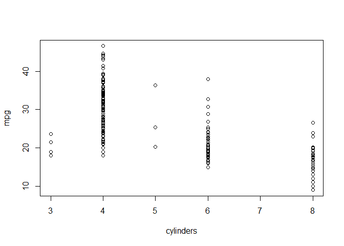<!-- -->

``` r
# Converting from quantitive to categorical
cylinders <- as.factor(cylinders)

# Plotting a qualitative variable on the x-axis will produce boxplots
plot(cylinders, mpg)
```

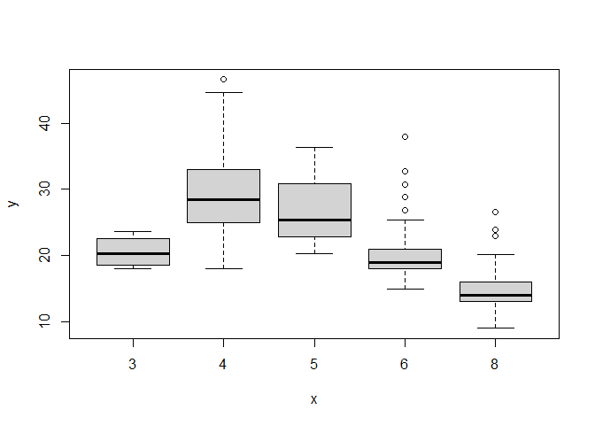<!-- -->

``` r
# Histograms can be plotted with the hist() function
hist(mpg)
```

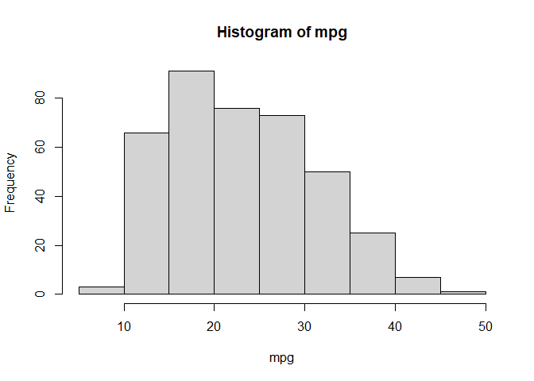<!-- -->

``` r
hist(mpg, col = 2, breaks = 15)
```

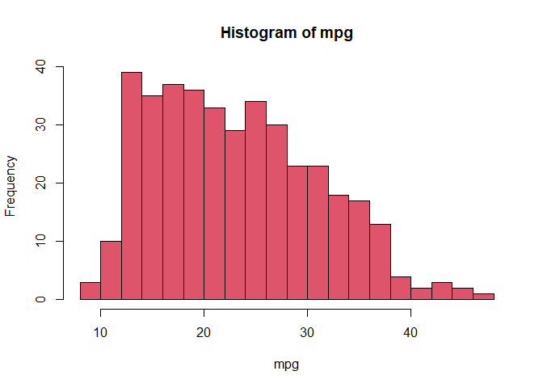<!-- -->

``` r
# The pairs() function creates a scatterlot matrix
pairs(Auto)
```

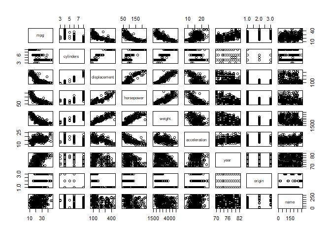<!-- -->

``` r
plot(horsepower, mpg)
```

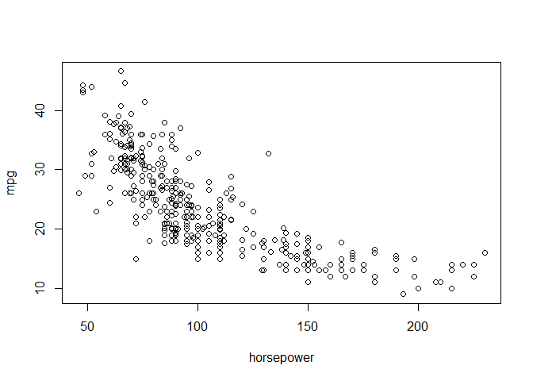<!-- -->

``` r
# The summary() function produces a summary numerical summary of variables in a dataset
summary(Auto)
```

    ##       mpg          cylinders      displacement     horsepower        weight    
    ##  Min.   : 9.00   Min.   :3.000   Min.   : 68.0   Min.   : 46.0   Min.   :1613  
    ##  1st Qu.:17.00   1st Qu.:4.000   1st Qu.:105.0   1st Qu.: 75.0   1st Qu.:2225  
    ##  Median :22.75   Median :4.000   Median :151.0   Median : 93.5   Median :2804  
    ##  Mean   :23.45   Mean   :5.472   Mean   :194.4   Mean   :104.5   Mean   :2978  
    ##  3rd Qu.:29.00   3rd Qu.:8.000   3rd Qu.:275.8   3rd Qu.:126.0   3rd Qu.:3615  
    ##  Max.   :46.60   Max.   :8.000   Max.   :455.0   Max.   :230.0   Max.   :5140  
    ##                                                                                
    ##   acceleration        year           origin                      name    
    ##  Min.   : 8.00   Min.   :70.00   Min.   :1.000   amc matador       :  5  
    ##  1st Qu.:13.78   1st Qu.:73.00   1st Qu.:1.000   ford pinto        :  5  
    ##  Median :15.50   Median :76.00   Median :1.000   toyota corolla    :  5  
    ##  Mean   :15.54   Mean   :75.98   Mean   :1.577   amc gremlin       :  4  
    ##  3rd Qu.:17.02   3rd Qu.:79.00   3rd Qu.:2.000   amc hornet        :  4  
    ##  Max.   :24.80   Max.   :82.00   Max.   :3.000   chevrolet chevette:  4  
    ##                                                  (Other)           :365

``` r
# We can also provide a summary of a single variable
summary(mpg)
```

    ##    Min. 1st Qu.  Median    Mean 3rd Qu.    Max. 
    ##    9.00   17.00   22.75   23.45   29.00   46.60

## Exercises

### Conceptual

***1. For each of parts (a) through (d), indicate whether we would
generally expect the performance of a flexible statistical learning
method to be better or worse than an inflexible method. Justify your
answer.***

*a) The sample size n is extremely large, and the number of predictors p
is small.*

*b) The number of predictors p is extremely large, and the number of
observations n is small.*

*c) The relationship between the predictors and response is highly
non-linear.* Flexible method

*d) The variance of the error terms, i.e. σ2 = Var(ϵ), is extremely
high.*

2.  Explain whether each scenario is a classification or regression
    problem, and indicate whether we are most interested in inference or
    prediction. Finally, provide n and p.
