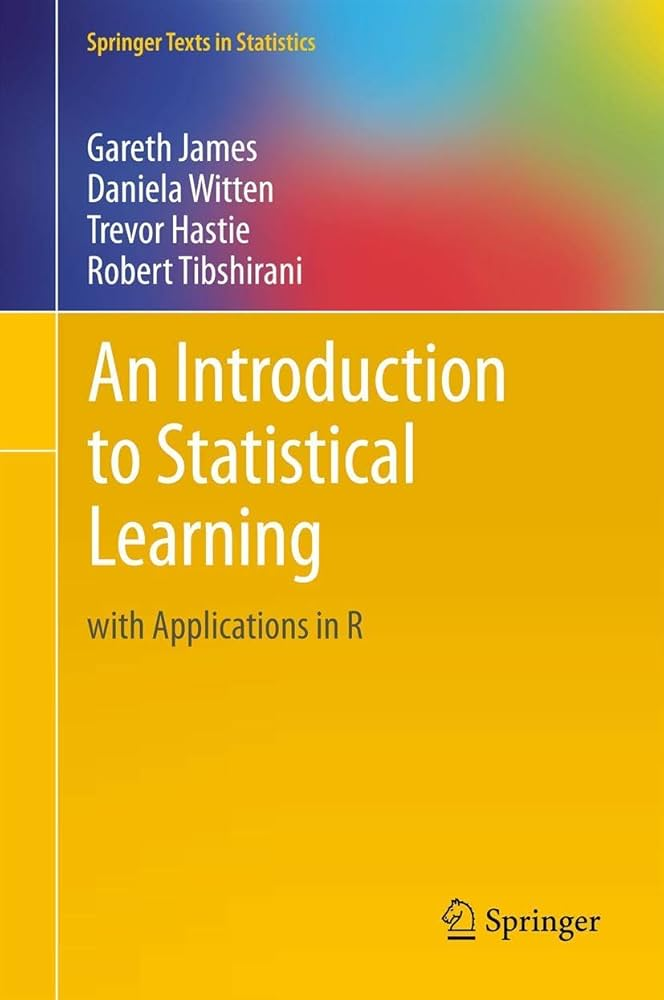

```{r setup, include=FALSE}
knitr::opts_chunk$set(echo = TRUE)
```

# An Introduction to Statistical Learning

Labs and exercises for the book 'An Introduction to Statistical Learning' by 
Gareth James, Daniela Witten, Trevor Hastie, and Rob Tibshirani.

Full book for both R and python available [here](https://www.statlearning.com/).
Video course avaiable [here](https://www.youtube.com/playlist?list=PLoROMvodv4rOzrYsAxzQyHb8n_RWNuS1e)

```{r, echo=FALSE, out.width="30%"}

```

## Contents

- 1 - Introduction
- 2 - Statistical Learning
- 3 - Linear Regression
- 4 - Classification
- 5 - Resampling Methods
- 6 - Linear Model Selection and Regularization
- 7 - Moving Beyond Linearity
- 8 - Tree-Based Methods
- 9 - Support Vector Machines
- 10 - Deep Learning
- 11 - Survival Analysis and Censored Data
- 12 - Unsupervised Learning
- 13 - Multiple Testing